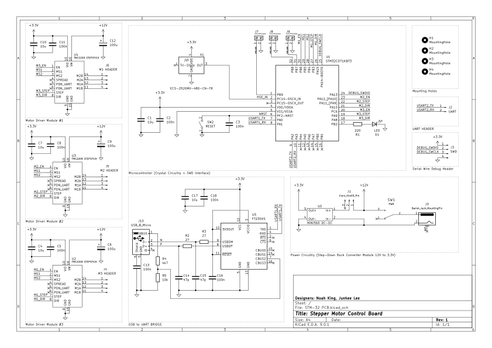
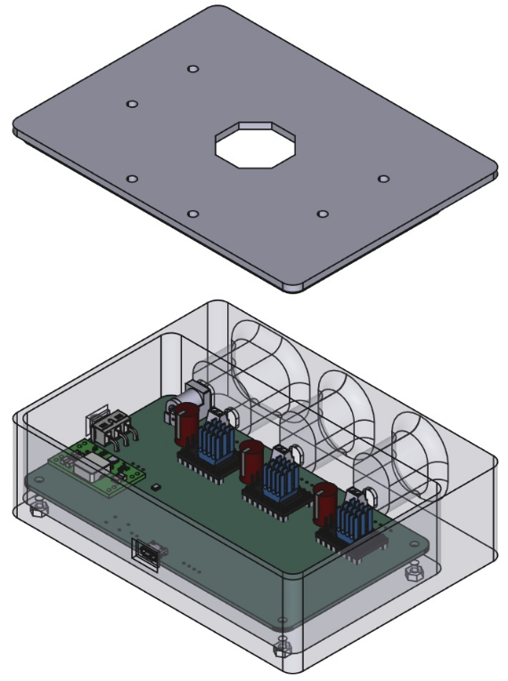
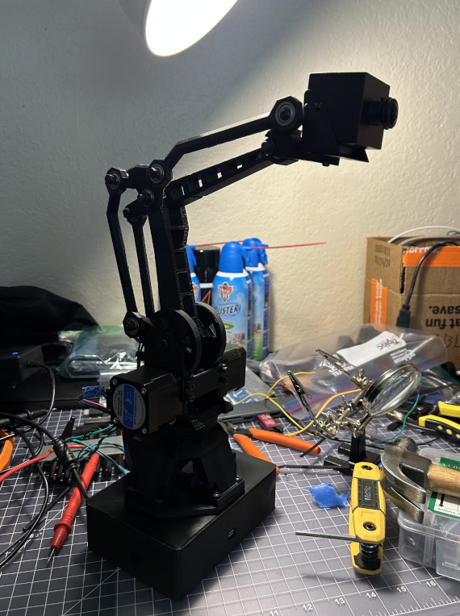

# SDP Robotic Arm

## Overview

This repository documents a Senior Design Project (SDP) centered around a robotic arm system. The project features **custom-developed firmware and hardware**, built to extend and optimize the functionality of an existing mechanical design. The full technical report can be found in the `Docs/` folder of this repository.

> ⚠️ Note: The mechanical CAD files—except for our custom-modeled housing—are sourced directly from the original forked repository, community_robot_arm, and remain unmodified. All hardware and firmware in this repository are original to this project.

| Custom Housing                   | Entire Assembly                  |
|----------------------------------|----------------------------------|
|       |          |

## Repository Structure

- `Firmware/` - Custom embedded firmware developed for motor control, sensing, and task coordination.
- `Hardware/` - Custom PCB schematics and layouts designed to interface with the robotic arm and support sensors and actuators.
- `Mechanical_Design/` - Original CAD files sourced from the forked project (see Acknowledgments).
- `Documentation/` - Design notes, test procedures, and system configuration details.

## Key Features

- Custom PCB design utilizing TMC-2209 motor drivers and an STM-32 microcontroller
- Face detection and tracking via external vision processing pipeline

## Acknowledgments

This project was developed by **Junhee Lee** and **Noah King** as part of their Senior Design Project. All firmware, hardware integration, and system-level enhancements were designed and implemented by the team.

Mechanical design elements, including all CAD files, originate from the [community_robot_arm](https://github.com/20sffactory/community_robot_arm) repository. These files were used unmodified and served as the foundation for the custom developments described in this repository.

